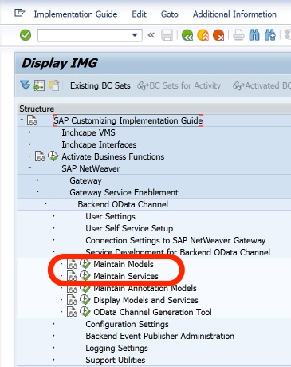
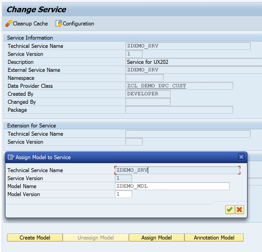
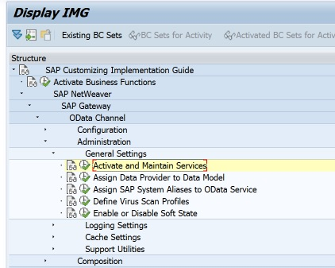
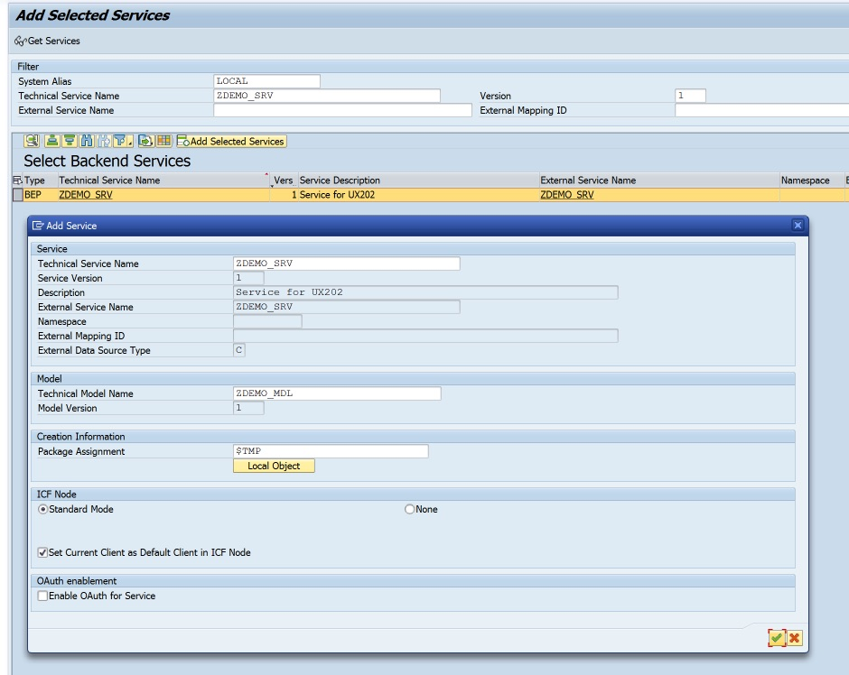

## Building NetWeaver Gateway Services

Thanks for your interest in my presentation "Building NetWeaver Gateway Services".

You can grab the ABAP code here and install it on your own system to look at it more closely and see it in action.

The earlier version of this presentation can be found at [teched16_example](https://grahamrobbo.github.io/teched16_example/).

This presentation has been updated for the 2017 SAUG Sydney Summit where it will be delivered by John Patterson & [Graham Robinson](https://github.com/grahamrobbo).


## Installation


To install the code onto your ABAP system you will need to use the [abapGit](http://abapgit.org) project by [@larshp](https://github.com/larshp).

If you haven't seen abapGit before I highly recommend you take a good look at it. If you find it useful perhaps you could consider joining the project and making your own contributions?

abapGit will transfer the ABAP code from my GitHub repository to a package on your ABAP system. I recommend using a local package just for this purpose called something like `$GWDEMO`.

### Setup

Once all objects are activated you will need to maintain the MPC and DPC locations. The below screenshot shows where to find this in the IMG.





You will then need to register the service



Select the "Add Service" button



The final step to get the Gateway Service running is to add a system alias.


For all other aspects about registering and activating SAP Gateway services consult the SAP documentation.

Enjoy!


Photo by M Gillet

### Markdown

Markdown is a lightweight and easy-to-use syntax for styling your writing. It includes conventions for

```markdown
Syntax highlighted code block

# Header 1
## Header 2
### Header 3

- Bulleted
- List

1. Numbered
2. List

**Bold** and _Italic_ and `Code` text

[Link](url) and 
```

For more details see [GitHub Flavored Markdown](https://guides.github.com/features/mastering-markdown/).

### Jekyll Themes

Your Pages site will use the layout and styles from the Jekyll theme you have selected in your [repository settings](https://github.com/grahamrobbo/building_gateway_services/settings). The name of this theme is saved in the Jekyll `_config.yml` configuration file.

### Support or Contact

Having trouble with Pages? Check out our [documentation](https://help.github.com/categories/github-pages-basics/) or [contact support](https://github.com/contact) and we’ll help you sort it out.
