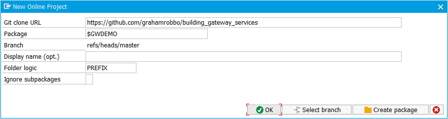
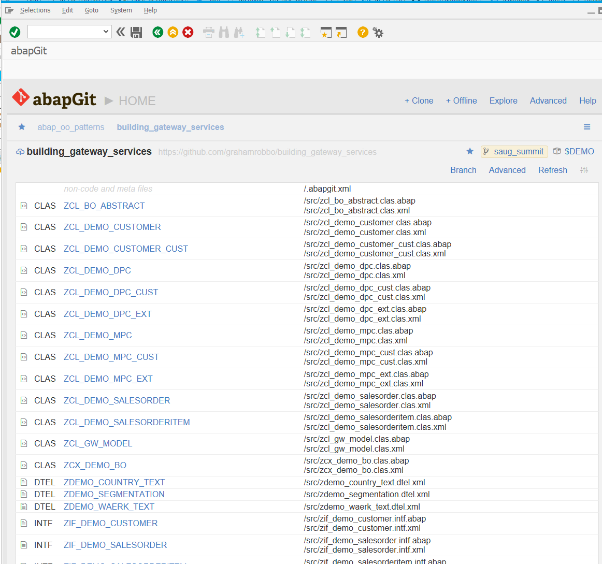
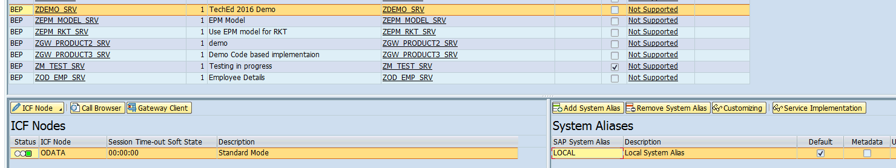

## Building SAP Gateway Services

Thanks for your interest in my presentation "Building SAP Gateway Services".

You can find the slides [here](./slides/slides.html).

You can grab the ABAP code from the repository and install it on your own system to look at it more closely, see it in action and fiddle with it yourself.

## Installation

To install the code onto your ABAP system you will need to use the [abapGit](http://abapgit.org) project by [@larshp](https://github.com/larshp).

Instructions for installing abapGit can be found [here](https://docs.abapgit.org/user-guide/).

If you haven't seen abapGit before I highly recommend you take a good look at it. If you find it useful perhaps you could consider joining the project and making your own contributions?

Use the abapGit `+ Online` option to link an ABAP package to my GitHub repository. See [Install Online Repository](https://docs.abapgit.org/user-guide/projects/online/install.html)

Alernatively you can also download the repository as a \*.zip file and import it using the `+ Offline` option. See [Import Zip](https://docs.abapgit.org/user-guide/projects/offline/import-zip.html)

I recommend using a local package just for this purpose called something like `$GWDEMO`.

Select the `Pull` option to load all the ABAP artifacts into your nominated package.

### Setup

Once all objects are activated you will need to maintain a system alias. You do this in transaction `/IWFND/MAINT_SERVICE`.

For all other aspects about SAP Gateway services consult the SAP documentation.

Enjoy!

    Photo by M Gillet
