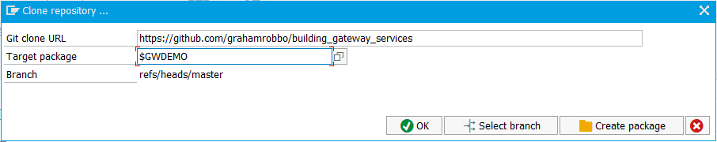

## Building NetWeaver Gateway Services

Thanks for your interest in my presentation "Building NetWeaver Gateway Services".

You can find the slides [here](./slides/slides.pdf).

You can grab the ABAP code from the repository and install it on your own system to look at it more closely, see it in action and fiddle with it yourself.

The earlier version of this presentation can be found at [teched16_example](https://grahamrobbo.github.io/teched16_example/).

This presentation has been updated for the 2017 SAUG Sydney Summit where it will be delivered by [@jasper07](jasper07) & [@grahamrobbo](https://github.com/grahamrobbo).

## Installation

To install the code onto your ABAP system you will need to use the [abapGit](http://abapgit.org) project by [@larshp](https://github.com/larshp).

Instructions for installing abapGit can be found [here](http://larshp.github.io/abapGit/).

If you haven't seen abapGit before I highly recommend you take a good look at it. If you find it useful perhaps you could consider joining the project and making your own contributions?

Use the abapGit `Clone` option to link an ABAP package to my GitHub repository. I recommend using a local package just for this purpose called something like `$GWDEMO`.

Select the `Pull` option to load all the ABAP artifacts into your nominated package.

### Setup

Once all objects are activated you will need to maintain the MPC and DPC locations. The below screenshot shows where to find this in the IMG.

You will then need to register the service

Select the "Add Service" button

The final step to get the Gateway Service running is to add a system alias.

For all other aspects about registering and activating SAP Gateway services consult the SAP documentation.

Enjoy!

    Photo by M Gillet

